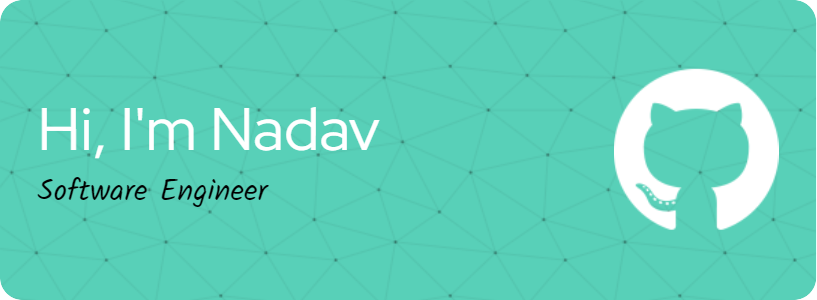

  
Welcome to my GitHub profile.

## 🚀 About Me
I'm a software engineer on a mission to merge technology and agriculture. My passion for ML/AI and web/native applications drives me to explore innovative ways to enhance sustainable farming practices. 🌱🌿

## 🛠️ Languages and Tools

  
  
  
  
  
  
  
  
  
  

## 📬 Let's Connect!

  

